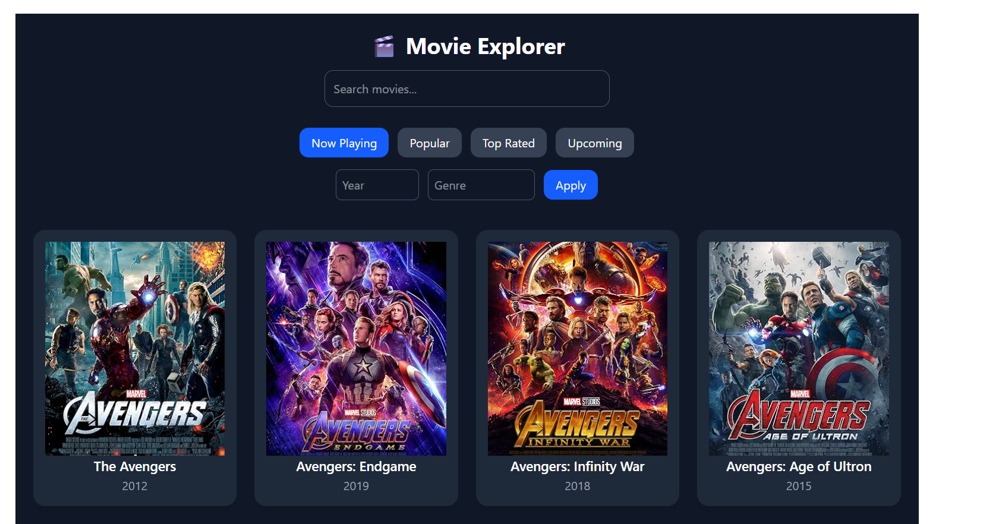

# 🎬 Movie Explorer

A responsive movie browsing app built with **React + Tailwind CSS**, powered by the **OMDb API**.  
Users can search, browse by categories, apply filters, and explore movies with infinite scrolling.

---

## ✨ Features

- 🔥 **Initial Render** – Loads default movies (Now Playing = Avengers)
- 🎭 **Movie Categories** – Quick filters: Now Playing, Popular, Top Rated, Upcoming
- 🔍 **Search Movies** – Debounced search (500ms delay to avoid excessive API calls)
- ♾️ **Infinite Scrolling** – Loads more movies when you scroll to the bottom
- 🎛 **Custom Filters** – Filter by **Year** & **Genre** using a custom `MyFilter` function (not `.filter()`)
- ⏳ **Loading & Error States** – User-friendly messages for loading, errors, and no results
- 📱 **Responsive UI** – Works beautifully on mobile & desktop with Tailwind CSS

---

## 🛠️ Tech Stack

- **Frontend:** React + Vite
- **Styling:** Tailwind CSS
- **API:** [OMDb API](https://www.omdbapi.com/)
- **Utilities:** Custom hooks (`useDebounce`), Infinite scroll with throttling

---

## 🚀 Getting Started

### 1️⃣ Clone the Repository

```bash
git clone https://github.com/your-username/movie-explorer.git
cd movie-explorer
```

`npm install`
`VITE_OMDB_API_KEY=your_api_key_here`
`npm run dev`

## Project Structure

```
src/
 ├── components/
 │    ├── MovieCard.jsx      # Displays movie poster, title, year
 │    ├── SearchBar.jsx      # Search input with debounce
 │    └── Filters.jsx        # Year & Genre filter
 ├── hooks/
 │    └── useDebounce.js     # Debounce hook
 ├── pages/
 │    └── Home.jsx           # Main page with movie grid
 ├── App.jsx
 ├── main.jsx
 └── index.css               # Tailwind setup
```

**Home Page**  

